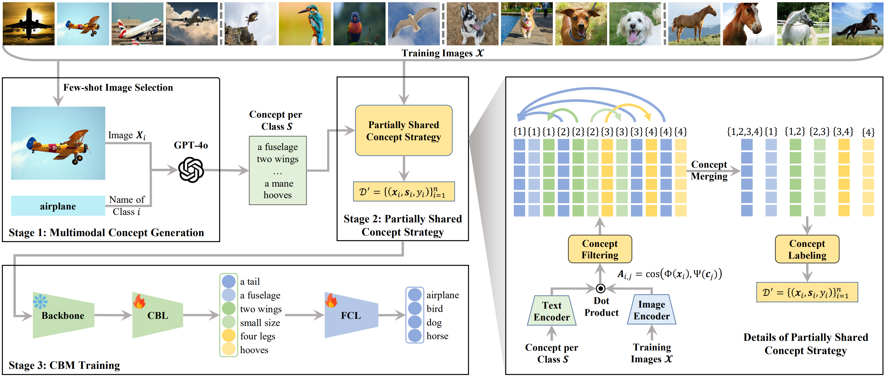

#  Partially Shared Concept Bottleneck Models (PS-CBM)
This is the official repository for our paper "Partially Shared Concept Bottleneck Models".

PS-CBM is a framework that introduces a partially shared concept strategy to reduce redundancy while preserving discrimination. It achieves state‑of‑the‑art accuracy using significantly fewer concepts.

<div align="center">
  
</div>

## ⚙️ Setup Environment
We run our experiments using Python 3.9.23. To set up the environment:
```
# Create a new conda environment
conda create --name pscbm python=3.9.23

# Activate the environment
conda activate pscbm

# Install required Python packages
pip install -r requirements.txt
```


## 📂 Dataset

All datasets should be placed under the `dataset/` directory.

### Dataset Structure

```
dataset/
└── <dataset_name>/
    ├── <dataset_name>_train/
    │   ├── <class_1>/
    │   ├── <class_2>/
    │   └── ...
    ├── <dataset_name>_val/
    │   ├── <class_1>/
    │   ├── <class_2>/
    │   └── ...
    ├── <dataset_name>_test/
    │   ├── <class_1>/
    │   ├── <class_2>/
    │   └── ...
    └── splits/
```

> **Note:** The class folder order in each of the train/val/test directories **must** match the sequence in  
> `data/classes_name/dataset_classes.txt`.

---

### Dataset Download

| Dataset       | Download Link                                                                                                              |
|---------------|----------------------------------------------------------------------------------------------------------------------------|
| Aircraft      | https://www.robots.ox.ac.uk/~vgg/data/fgvc-aircraft/archives/fgvc-aircraft-2013b.tar.gz                                    |
| CIFAR10       | https://www.cs.toronto.edu/~kriz/cifar-10-python.tar.gz                                                                    |
| CIFAR100      | https://www.cs.toronto.edu/~kriz/cifar-100-python.tar.gz                                                                   |
| CUB200        | https://data.caltech.edu/records/20098                                                                                     |
| DTD           | https://www.robots.ox.ac.uk/~vgg/data/dtd/download/dtd-r1.0.1.tar.gz                                                       |
| Flowers102    | https://www.robots.ox.ac.uk/~vgg/data/flowers/102/102flowers.tgz                                                           |
| Food101       | http://data.vision.ee.ethz.ch/cvl/food-101.tar.gz                                                                          |
| HAM10000      | https://dataverse.harvard.edu/dataset.xhtml?persistentId=doi:10.7910/DVN/DBW86T#                                           |
| ImageNet      | https://image-net.org/index.php                                                                                            |
| RESISC45      | https://1drv.ms/u/s!AmgKYzARBl5ca3HNaHIlzp_IXjs                                                                            |
| UCF101        | https://drive.google.com/file/d/10Jqome3vtUA2keJkNanAiFpgbyC9Hc2O/view?usp=sharing                                         |


## 🗂️ Directories

Below is an overview of the key directories and files in this project:

### Main Directories

```
data/
├── classes_name/         # Contains dataset-specific class name files (e.g., dataset_name_classes.txt)
├── generate_concept/     # Stores generated concept JSON files
└── selected_image/       # Stores selected few-shot exemplar images

dataset/                  # Contains downloaded datasets and split files
                          # You must reorganize datasets using split files and class order files manually
                          # We provide a toy version of CIFAR-10 (1/10 sampling) in dataset/CIFAR10

model/                    # Contains model implementation

save_model/               # Stores trained model checkpoints
```

### Other Files

- `data_utils.py`, `utils_my.py`: Data loading, processing utilities, and core logic for the **Partially Shared Concept Strategy**
- `run_train.py`, `run_train_on_imagenet.py`: Scripts for training, evaluating, and saving models  
  *(Note: Due to ImageNet’s scale, custom loading strategies are used to reduce resource demands.)*
- `select_image.ipynb`: Select exemplars from training images
- `generate_concept.ipynb`: Generate concept JSON files
- `run_commands.txt`, `run_commands_toyDataset.txt`: Shell command templates for training  
  *(We recommend starting with `run_commands_toyDataset.txt` on the toy CIFAR-10 dataset for quick tests.)*


## 🚀 Pipeline
Follow the steps below to train and evaluate the PS-CBM model.

### 1. Creating Concept Sets (Optional)

>This step is optional because we have already provided pre-generated concept files for each dataset in the `data/generate_concept/concept/` directory. You can directly use them without running these notebooks.

Run the following notebooks to generate your concept set:
If you wish to create your own concept sets (e.g., with different exemplars or criteria), you can run the following notebooks:
```
# Select exemplar images from the training set
select_image.ipynb

# Generate concept JSON files from selected exemplars
generate_concept.ipynb
```

### 2. Training, Testing, and Saving the PS-CBM Model
Use the commands provided in run_commands.txt.

Example command:
```
python run_train.py \\
  --dataset CIFAR10 \\
  --backbone "clip_RN50" \\
  --save_dir "save_model" \\
  --concept_set "data/generate_concept/concept/CIFAR10_concepts_gpt-4o_final.json" \\
  --Tmerge 0.9996 \\
  --Tconf 0.20 \\
  --lam 0.0007 \\
  --n_iters 10000 \\
  --saga_batch_size 256 \\
  --cbl_layer_num 2 \\
  --cbl_bias \\
  --use_penultimate \\
  --cbl_batch_size 1024 \\
  --cbl_lr 0.0004 \\
  --cbl_steps 20000 \\
  --weight_decay 0 \\
  --K_indep 5
  ```

  You can modify the command parameters in run_commands.txt or use run_commands_toyDataset.txt for quick testing on the toy CIFAR-10 dataset.